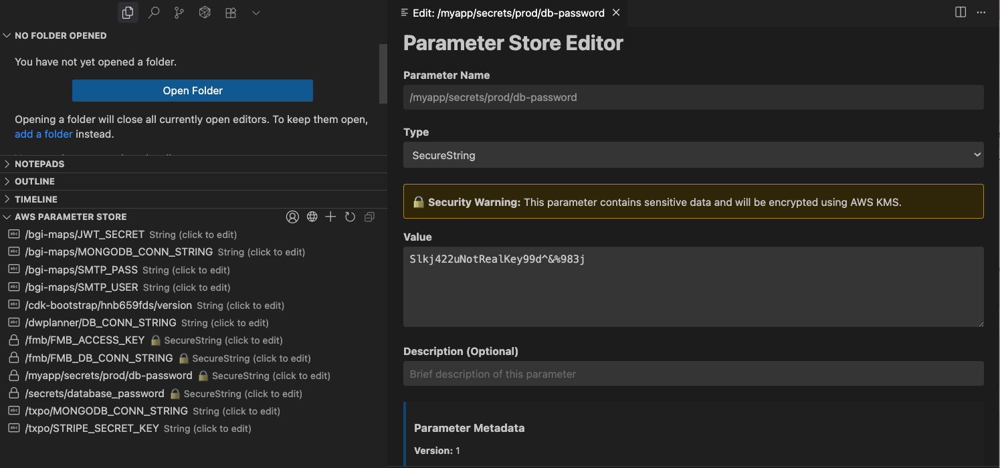

# AWS Parameter Store Extension for VS Code

A Visual Studio Code extension that allows you to easily view and manage AWS Systems Manager Parameter Store values using your local AWS profiles.



*Screenshot showing the extension in action with parameter list and secure parameter editor*

## Features

- **Profile Management**: Automatically detects and uses your local AWS profiles from `~/.aws/credentials` and `~/.aws/config`
- **Region Selection**: Choose from any AWS region, with automatic detection from your profile settings
- **Parameter Viewing**: Browse all parameters in a tree view with organized folder structure
- **Secure Parameter Support**: View and edit both standard and SecureString parameters
- **Parameter Editing**: Create, edit, and delete parameters with a user-friendly interface
- **Quick Actions**: Copy parameter names and values to clipboard
- **Real-time Updates**: Refresh parameter list and see changes immediately

## Prerequisites

- VS Code version 1.74.0 or higher
- AWS CLI configured with profiles in `~/.aws/credentials` and/or `~/.aws/config`
- Appropriate AWS IAM permissions for Systems Manager Parameter Store

## Required AWS Permissions

Your AWS profile needs the following permissions:

```json
{
    "Version": "2012-10-17",
    "Statement": [
        {
            "Effect": "Allow",
            "Action": [
                "ssm:GetParameter",
                "ssm:GetParameters",
                "ssm:GetParametersByPath",
                "ssm:DescribeParameters",
                "ssm:PutParameter",
                "ssm:DeleteParameter"
            ],
            "Resource": "*"
        },
        {
            "Effect": "Allow",
            "Action": [
                "kms:Decrypt",
                "kms:Encrypt"
            ],
            "Resource": "*",
            "Condition": {
                "StringEquals": {
                    "kms:ViaService": "ssm.*.amazonaws.com"
                }
            }
        }
    ]
}
```

## Installation

1. Install the extension from the VS Code marketplace
2. Ensure your AWS credentials are configured in `~/.aws/credentials`
3. Open the AWS Parameter Store view in the Explorer sidebar

## Usage

### Selecting AWS Profile and Region

1. Click on the AWS profile indicator in the status bar (bottom left)
2. Select your desired AWS profile from the dropdown
3. Use the region selection button in the Parameter Store view to change regions

### Viewing Parameters

- Parameters are displayed in a tree structure in the Explorer sidebar
- Folder icons represent parameter paths
- Lock icons indicate SecureString parameters
- Hover over parameters to see metadata (type, version, last modified date)

### Creating Parameters

1. Click the "+" button in the Parameter Store view
2. Fill in the parameter details in the editor
3. Choose the parameter type (String, StringList, or SecureString)
4. Click "Save Parameter"

### Editing Parameters

1. Right-click on a parameter and select "Edit Parameter"
2. Or click the edit icon next to the parameter
3. Modify the values in the editor
4. Click "Save Parameter" to update

### Deleting Parameters

1. Right-click on a parameter and select "Delete Parameter"
2. Confirm the deletion in the dialog

### Copying Values

- Right-click on a parameter to copy its name or value to the clipboard
- Useful for referencing parameters in your code

## Configuration

The extension supports the following settings:

- `awsParameterStore.defaultProfile`: Default AWS profile to use (default: "default")
- `awsParameterStore.defaultRegion`: Default AWS region to use (default: "us-east-1")
- `awsParameterStore.parametersPerPage`: Number of parameters to fetch per page (default: 50)
- `awsParameterStore.showSecureValues`: Show secure parameter values (default: false)

## Security Notes

- SecureString parameters are automatically decrypted when viewed (requires KMS permissions)
- Parameter values are not cached locally for security
- The extension uses your local AWS credentials and follows AWS security best practices

## Troubleshooting

### No AWS profiles found
- Ensure AWS CLI is installed and configured
- Check that `~/.aws/credentials` file exists and contains valid profiles
- Verify file permissions allow reading

### Permission denied errors
- Verify your AWS profile has the required SSM and KMS permissions
- Check that your credentials are not expired
- Ensure you're using the correct region

### Parameters not loading
- Verify your AWS credentials are valid
- Check your internet connection
- Ensure the selected region contains parameters

## Development

To contribute to this extension:

1. Clone the repository
2. Run `npm install` to install dependencies
3. Open in VS Code and press F5 to run in a new Extension Development Host
4. Make your changes and test
5. Submit a pull request

## Author

Created by **Murtaza Nooruddin**

## License

This extension is released under the MIT License and is free to use for personal and commercial projects.

